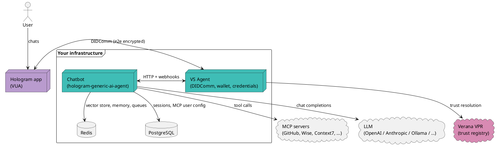

# What is a Hologram agent?

A **Hologram agent** is a small server — one container, one DIDComm endpoint, one YAML manifest — that a user reaches through the [Hologram Messaging](https://hologram.zone) app and interacts with as if it were any other chat contact. It runs on your infrastructure, presents verifiable credentials, and does whatever you configure it to: answer questions with an LLM, call external APIs through MCP, issue credentials, verify them, take approvals.

This page walks through what's inside a running agent and where each piece comes from.

## Mental model



Two processes, one conceptual agent:

- **VS Agent** (`verana-labs/vs-agent`) — handles the DIDComm side. Speaks the protocol, owns the wallet and keys, resolves trust against the VPR, exposes an admin HTTP API at `:3000` and a public DIDComm endpoint at `:3001`. Stateless from the chatbot's point of view.
- **Chatbot** (`io2060/hologram-generic-ai-agent-app`) — the smart side. Receives message webhooks from the VS Agent, runs them through an LLM with tools, calls MCP servers, decides who to send messages back to, triggers credential flows through the VS Agent's admin API.

Your users only see one agent. Your deployment typically runs these as two containers in a pod, plus Redis and PostgreSQL for state.

## The conversation loop

From the moment a user scans your agent's QR code:

1. **Connection request.** The user's Hologram app sends a DIDComm connection request to your VS Agent's public endpoint.
2. **Mutual trust resolution.** Your VS Agent walks the user's Linked Verifiable Presentations back to a recognized issuer via the Verana VPR. The user's app does the same for your agent. Both sides apply their own acceptance policy.
3. **Welcome message.** Once connected, the VS Agent fires a `connection-state-updated` webhook at the chatbot. The chatbot looks up the user's profile language, renders the agent pack's `greetingMessage` template, and sends it through the VS Agent's admin API.
4. **Chat.** Every user message becomes a `message-received` webhook. The chatbot appends it to the session memory, runs it through the LLM with the available tools (LangChain + MCP + dynamic HTTP tools), and streams the response back out through DIDComm.
5. **Credential flows.** When the agent pack declares `flows.authentication` or the user taps an **Authenticate** menu item, the chatbot asks the VS Agent to issue a presentation request. The user's app fulfils it, the VS Agent verifies it, the chatbot lifts the session's roles from the verified claims.
6. **Menu actions.** Every interaction has a contextual menu: authenticate, log out, configure MCP tokens, view pending approvals. Menu items are declared in `flows.menu` and their visibility reacts to session state (`authenticated`, `unauthenticated`, `hasPendingApprovals`, …).

The chatbot is event-driven end-to-end. The same container handles one user or ten thousand — scale it horizontally behind a queue when you need to.

## What declares the behaviour

Nearly nothing about an agent's behaviour is code. It's **configuration** in one YAML file.

```yaml
# agent-pack.yaml — this is almost the whole agent
metadata:
  id: hologram-example-agent
  displayName: Hologram Example Agent

languages:
  en:
    greetingMessage: "Hi! Ask me anything about Hologram or any library."

llm:
  provider: openai
  model: gpt-4o-mini

mcp:
  servers:
    - name: context7
      transport: streamable-http
      url: https://mcp.context7.com/mcp
      accessMode: admin-controlled

flows:
  authentication:
    enabled: true
    credentialDefinitionId: ${CREDENTIAL_DEFINITION_ID}
```

Change the prompts, swap the LLM, add an MCP server, require a different credential, gate tools behind roles — all in that file. The Docker image never changes. That's what the [Agent Pack](../build/agent-pack/overview.md) is.

## What an agent is *not*

- **Not a WhatsApp bot.** No phone number, no centralized platform. Your users connect via DIDComm over the Hologram app.
- **Not an always-logged-in account.** Your agent doesn't know a user's phone number, email, or location. It only knows what it has cryptographically verified (e.g. "this user presented an `employee` credential issued by `acme.corp`").
- **Not a single-LLM wrapper.** The agent is a container that orchestrates conversation state, credential flows, tool access, approvals, and identity. The LLM is one of many moving parts.
- **Not a monolith.** VS Agent is reusable on its own — you can build credential issuers, credential verifiers, or pure DIDComm services against it without the chatbot side. See the [Advanced: bare VS Agent](../build/advanced/bare-vs-agent.md) tutorial.

## Where to go next

- [**Quickstart**](../build/quickstart.md) — fork `hologram-ai-agent-example` and talk to a running agent in 10 minutes.
- [**Agent Pack overview**](../build/agent-pack/overview.md) — the structure of `agent-pack.yaml`.
- [**The trust model**](./trust.md) — VS, VUA, VPR.
