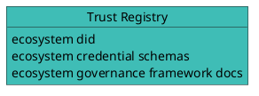

# Hologram SDK docs howto

## Plantuml

Plantuml is enabled:



## Doc file names

In sub-directories, prefix names with a number to be able to use autogenerated: 


```json
buildSidebar: [
        {
          type: 'category',
          label: 'Build',
          items: [
            'build/intro',
            
          ],
        },
        {
            type: 'category',
            label: 'Getting Started',
            items: [
             
              {
                type: 'autogenerated',
                dirName: 'build/getting-started',  // auto-generate from this subfolder
              },
              
            ],
          },
          
    ],

```