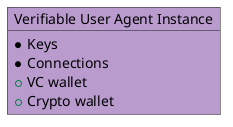
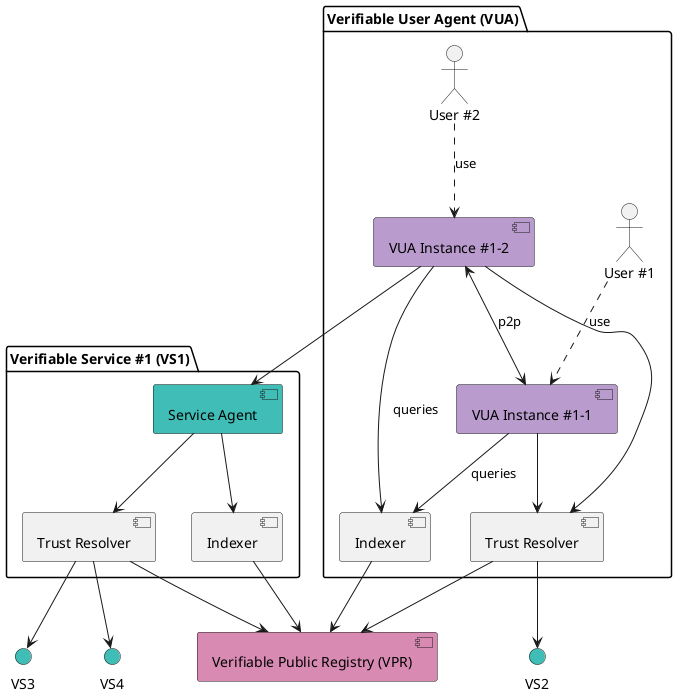
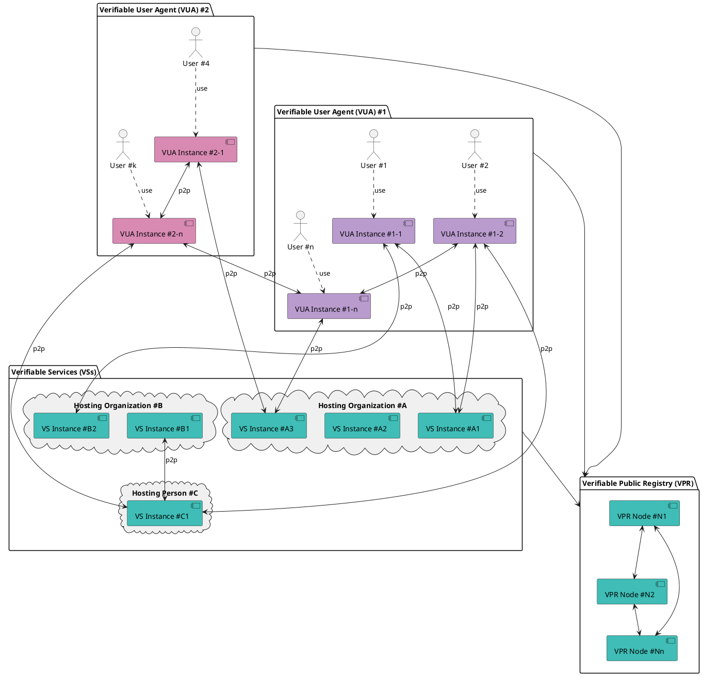

# The trust model

Hologram is built on the [Verifiable Trust specification](https://verana-labs.github.io/verifiable-trust-spec/) — three peer types ([introduced here](./introduction.md#three-kinds-of-peers)) interacting through a public registry. This page is the deeper picture: how a VS, a VUA, and the VPR compose into a working decentralised trust mesh.

Every peer is identified by a [DID](https://www.w3.org/TR/did-1.0/) and authenticates by presenting verifiable credentials *before* the connection completes. Both sides of every connection check each other; non-verifiable peers are rejected.

If a peer wants to **issue** credentials or **request** credential presentation, it must first prove (via the registry) that it is authorised to perform that action. Otherwise the counterparty refuses the request.

## Verifiable User Agent (VUA)

A verifiable user agent (VUA) is software — a browser, app, or wallet — designed to connect to verifiable services (VS) and other VUAs. When establishing connections, a VUA must verify the identity and trustworthiness of its peers and allow connections only to compliant peers.

As part of this process, the verifiable user agent (VUA) must perform trust resolution by:

- Verifying the verifiable credentials presented by peers;

- Querying verifiable public registries (VPRs) to confirm that the credentials were issued by recognized and authorized issuers.

This ensures that all connections are established on the basis of verifiable trust, rather than assumptions.

In addition, VUAs can query an index (the DID directory, managed by the VPR - see below) that catalogs all known verifiable services (VSs), to search VSs compatible with the VUA or VSs that present a certain type of credential. This enables:

- users to search for and discover relevant services: for example, within a social browser VUA, a user could search for a social channel VS by querying the index for an influencer’s name.

- VUA vendors to require VSs to present a certain type of credential (free or paid) for being listed in the VUA, of for having specific features in the VUA (premium, etc).

[Hologram Messaging](https://hologram.zone), a chatbot and AI agent browser, is the **first known verifiable user agent**.

## Verifiable Public Registry (VPR)

### Trust Registries

A VPR is a **“registry of registries”**, a public, permissionless service that provides foundational infrastructure for decentralized trust ecosystems, as specified in the [Verifiable Public Registry (VPR) specification](https://verana-labs.github.io/verifiable-trust-vpr-spec/).

It is used by ecosystems that want to define credential schemas and who can issue or verify credentials of these schemas.

Purpose of a VPR is to answer these questions:

- is participant #1 **recognized** by ecosystem E1?
- can participant #1 **issue credential** for schema ABC of ecosystem E1?
- can participant #2 request **credential presentation** of credential issued by issuer DEF from schema GHI of ecosystem E2 in context CONTEXT?

[VPRs are detailed here](https://docs.verana.io/docs/next/learn/verifiable-public-registry/trust-registries)

### Discovery through indexers

The VPR itself doesn't host a list of services — it hosts **permissions**: *which participants are authorised to issue, verify, or govern each credential schema, in each ecosystem*. This is the data that feeds real-time trust resolution (the "can this DID issue credential X?" lookup performed on every connection).

For **discovery** — letting end users search or browse agents — the permission directory is designed to be **crawled by indexers**. An indexer walks the permissions on-chain, resolves each participant [DID](https://www.w3.org/TR/did-1.0/), inspects its [Linked Verifiable Presentations](https://identity.foundation/linked-vp/) to identify the verifiable services it operates, and publishes a searchable catalogue.

This keeps the VPR small and keeps discovery competitive: anyone can run an indexer, expose an API, or build a search engine over the permission directory. The Hologram app surfaces agents through this indexed view; ecosystem governors can publish their own filtered views; third-party search engines can rank services by verifiable metadata instead of marketing spend.

## Build for decentralization

Connections between verifiable services (VSs) and/or verifiable user agents (VUAs) are fully decentralized and verifiable.

In the example below, we have two verifiable user agents #1 and #2 from different vendors. Instances of these compliant VUAs can establish connections with other instances, and with verifiable services from all organizations. Verifiable services can connect to other verifiable services.

:::tip
Verifiable services can be hosted anywhere, based on service provider (organization, person) decision.
:::

## In practice

You don't wire any of this by hand. In practice, every piece on this diagram — the service DID, the credentials it presents, the trust resolver it uses, the schemas it accepts, the access control it enforces — is **declared in a single `agent-pack.yaml` manifest**, loaded at startup by the generic AI agent container.

Head over to the [Quickstart](../build/quickstart.md) to fork a working example, or read the [Agent Pack overview](../build/agent-pack/overview.md) for the declarative surface area.
